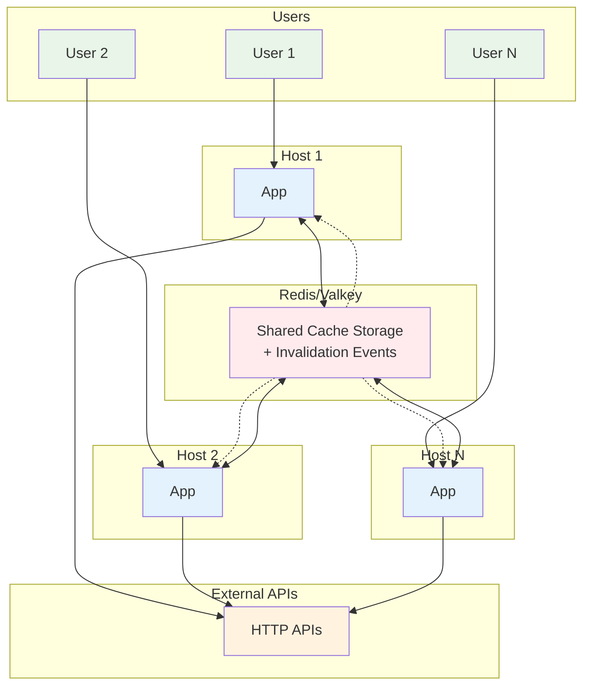

# undici-cache-redis

A high-performance Redis-backed cache store for [Undici's](https://github.com/nodejs/undici) cache interceptor. This library provides seamless HTTP response caching with Redis/Valkey as the storage backend, featuring client-side caching, cache invalidation by tags, and support for managed Redis environments.

Built on top of [iovalkey](https://github.com/valkey-io/iovalkey) for optimal Redis/Valkey connectivity.

## Features

- 🚀 **High Performance**: Redis-backed caching with client-side optimization
- 🏷️ **Cache Tags**: Invalidate cached responses by custom tags
- 🔄 **Automatic Invalidation**: Smart cache invalidation on mutating operations
- 📊 **Cache Management**: Built-in cache manager for monitoring and administration
- 🌐 **Vary Header Support**: Proper handling of content negotiation
- ☁️ **Cloud Ready**: Works with managed Redis services (AWS ElastiCache, etc.)
- 💾 **Binary Support**: Handles both text and binary response data
- 📈 **Tracking Cache**: Client-side caching for improved performance

## Installation

```bash
npm install undici-cache-redis
```

## Documentation

### Quick Start

#### Basic Usage

```javascript
import { Agent, interceptors } from 'undici'
import { createStore } from 'undici-cache-redis'

// Create a Redis cache store (v2 by default)
const store = createStore({
  clientOpts: {
    host: 'localhost',
    port: 6379
  },
  prefix: 'my-app:cache'
})

// Create Undici agent with caching
const agent = new Agent().compose(interceptors.cache({ store }))

// Make requests - responses will be automatically cached
const response = await agent.request({
  origin: 'https://api.example.com',
  method: 'GET',
  path: '/users/123'
})

console.log(await response.body.text())
```

#### Cache Invalidation by Tags

```javascript
import { Agent, interceptors } from 'undici'
import { createStore } from 'undici-cache-redis'

const store = createStore({
  cacheTagsHeader: 'cache-tags', // Header to read cache tags from
  prefix: 'my-app:cache'
})

const agent = new Agent().compose(interceptors.cache({ store }))

// Server responds with: Cache-Tags: user:123,profile
const response = await agent.request({
  origin: 'https://api.example.com',
  method: 'GET',
  path: '/users/123'
})

// Later, invalidate all cached responses tagged with 'user:123'
await store.deleteTags(['user:123'])
```

#### Unified Cache Manager

In v2, the cache store and manager are unified into a single class. You can use both store and manager operations on the same instance:

```javascript
import { createStore, createManager } from 'undici-cache-redis'

// Both create the same unified Cache instance
const store = createStore({ prefix: 'my-app:cache' })
const manager = createManager({ prefix: 'my-app:cache' })

// Subscribe to cache events
await manager.subscribe()

manager.on('subscription:entry:add', ({ id, metadata, value }) => {
  console.log('Cache entry added:', metadata.path, metadata.tags)
})

manager.on('subscription:entry:delete', ({ id, prefix }) => {
  console.log('Cache entry deleted:', id)
})

// Stream through all cache entries
await manager.streamEntries(entry => {
  console.log(`Entry: ${entry.path}, Tags: [${entry.tags.join(', ')}]`)
})

// Get entries by tag
const taggedEntries = await manager.getTag('user:123')
console.log(`Found ${taggedEntries.length} entries with tag 'user:123'`)

// Get dependent entries (entries sharing cache tags)
const dependentEntries = await manager.getDependentEntries('some-entry-id')

// Invalidate by tags
await store.deleteTags(['user:123', 'products'])

// Delete specific entries by ID
await manager.deleteIds(['entry-id-1', 'entry-id-2'])

// Get response body for debugging
const responseBody = await manager.getResponseById('some-entry-id')
```

### Configuration Options

#### Cache Options

```typescript
interface CacheOptions {
  // Redis client options (passed to iovalkey)
  clientOpts?: {
    host?: string
    port?: number
    // ... other iovalkey options (excludes keyPrefix)
  }

  // Key prefix for Redis keys (replaces clientOpts.keyPrefix)
  prefix?: string

  // Maximum size in bytes for a single cached response (default: 10MB)
  maxEntrySize?: number

  // Maximum batch size for bulk operations (default: 100)
  maxBatchSize?: number

  // Concurrency for parallel operations (default: 10)
  concurrency?: number

  // Enable/disable client-side tracking cache (default: true)
  tracking?: boolean

  // Configure client-side tracking options (default: true)
  clientConfigTracking?: boolean

  // Maximum size in bytes for tracking cache
  maxSize?: number

  // Maximum number of entries in tracking cache
  maxCount?: number

  // Header name to read cache tags from responses
  cacheTagsHeader?: string

  // Configure keyspace event notifications (default: true)
  // Set to false for managed Redis services
  clientConfigKeyspaceEventNotify?: boolean

  // Error callback function
  errorCallback?: (err: Error) => void
}
```

### Advanced Usage Examples

#### Using with fetch()

```javascript
import { Agent, interceptors, setGlobalDispatcher } from 'undici'
import { createStore } from 'undici-cache-redis'

// Create a Redis cache store
const store = createStore()

// Create agent with caching
const agent = new Agent().compose(interceptors.cache({ store }))

// Set as global dispatcher to enable caching for fetch
setGlobalDispatcher(agent)

// Now fetch() automatically uses the cache!
const response = await fetch('https://api.example.com/users/123')
const data = await response.json()

// Cache headers are available
if (response.headers.get('x-cache') === 'HIT') {
  console.log('Response was served from cache!')
}
```

#### Working with Vary Headers

```javascript
const store = createStore()
const agent = new Agent().compose(interceptors.cache({ store }))

// Different responses cached based on Accept-Language header
const responseEn = await agent.request({
  origin: 'https://api.example.com',
  method: 'GET',
  path: '/content',
  headers: { 'Accept-Language': 'en' }
})

const responseFr = await agent.request({
  origin: 'https://api.example.com',
  method: 'GET',
  path: '/content',
  headers: { 'Accept-Language': 'fr' }
})
```

#### Multi-Prefix Operations

V2 supports operations across multiple prefixes for multi-tenant or multi-environment scenarios:

```javascript
const store = createStore({ prefix: 'tenant1:cache' })

// Get entry from multiple prefixes
const entry = await store.get({ origin: 'https://api.example.com', method: 'GET', path: '/users/123' }, [
  'tenant1:cache',
  'tenant2:cache',
  'shared:cache'
])

// Delete entries across multiple prefixes
await store.deleteKeys(
  [{ origin: 'https://api.example.com', method: 'GET', path: '/users/123' }],
  ['tenant1:cache', 'tenant2:cache']
)

// Get all entries with a specific tag across prefixes
const entries = await store.getTag('user:123', ['tenant1:cache', 'tenant2:cache'])

// Subscribe to events from multiple prefixes
await store.subscribe(['tenant1:cache', 'tenant2:cache'])
```

#### Manual Cache Operations

```javascript
const store = createStore()

// Delete cache entries by key
await store.delete({ origin: 'https://api.example.com', method: 'GET', path: '/users/123' })

// Delete specific entries by key
await store.deleteKeys([
  { origin: 'https://api.example.com', method: 'GET', path: '/users/123' },
  { origin: 'https://api.example.com', method: 'GET', path: '/users/456' }
])

// Delete by cache tags
await store.deleteTags(['user:123', 'profile'])

// Delete by specific IDs
await store.deleteIds(['entry-id-1', 'entry-id-2'])

// Get multiple entries efficiently
const entries = await store.getKeys([
  { origin: 'https://api.example.com', method: 'GET', path: '/users/123' },
  { origin: 'https://api.example.com', method: 'GET', path: '/users/456' }
])

// Close the store when done
await store.close()
```

#### Error Handling

```javascript
const store = createStore({
  errorCallback: err => {
    console.error('Cache error:', err.message)
    // Send to monitoring service
    monitoringService.error('cache_error', err)
  }
})
```

### Managed Redis Services

When using managed Redis services like AWS ElastiCache, some Redis commands may be restricted. Configure the cache accordingly:

```javascript
const store = createStore({
  clientConfigKeyspaceEventNotify: false, // Disable auto-configuration
  clientOpts: {
    host: 'your-elasticache-endpoint.cache.amazonaws.com',
    port: 6379
  }
})
```

Ensure your managed Redis instance has the following configuration:

- `notify-keyspace-events AKE` (for event notifications)

### Multi-Host Architecture



**Flow**: Users make requests → Apps check Redis cache → If miss, fetch from APIs → Cache responses → Invalidation events sync all hosts.

### V2 Architecture and Data Structure

V2 uses an optimized Redis data structure based on sorted sets with lexicographical ordering:

#### Key Structure

- **Routes**: `{prefix}routes` - Sorted set of all cached origins and paths
- **Tags**: `{prefix}tags` - Sorted set of all cache tags
- **Tag Index**: `{prefix}tags|{tagName}` - Sorted set of entry IDs for a specific tag
- **Requests**: `{prefix}requests|{origin}|{path}` - Sorted set of HTTP methods for a route
- **Request Variants**: `{prefix}request|{origin}|{path}|{method}` - Sorted set of cache identifiers (with vary info)
- **Variant Tracking**: `{prefix}variants|{origin}|{path}|{method}` - Sorted set for deduplication
- **Metadata**: `{prefix}metadata|{id}` - JSON metadata for cache entry
- **Body**: `{prefix}body|{id}` - Base64-encoded response body

#### Auto-Cleaning

All sorted sets in v2 are auto-cleaning:

- When traversing sets, expired entries are automatically detected and removed
- Automatic cleanup is scheduled via the cleanup queue
- Cleanup runs asynchronously without blocking operations
- Graceful shutdown ensures all pending cleanup tasks complete

### API Reference

#### Cache (Store & Manager)

##### Methods

**Store Methods:**

- `get(key: CacheKey, prefixes?: string | string[]): Promise<CacheValueWithBody | undefined>` - Retrieve cached response with body
- `get(key: CacheKey, prefixes: string | string[] | undefined, includeBody: false): Promise<CacheValueWithAdditionalProperties | undefined>` - Retrieve cached response metadata only
- `getKeys(keys: Iterable<CacheKey>, prefixes?: string | string[]): Promise<CacheValueWithBody[]>` - Get multiple cache entries efficiently
- `createWriteStream(key: CacheKey, value: CacheValue): Writable` - Create write stream for caching
- `delete(key: CacheKey, prefixes?: string | string[]): Promise<void>` - Delete all cache entries for a route (all methods)
- `deleteKeys(keys: Iterable<CacheKey>, prefixes?: string | string[]): Promise<void>` - Delete specific cache entries
- `deleteTag(tags: string | string[], prefixes?: string | string[]): Promise<void>` - Delete entries matching ALL specified tags
- `deleteTags(tags: Array<string | string[]>, prefixes?: string | string[]): Promise<void>` - Delete entries for each tag/tag combination
- `close(): Promise<void>` - Close Redis connections

**Manager Methods:**

- `streamEntries(callback: (entry: CacheValueWithAdditionalProperties) => unknown | Promise<unknown>, prefixes?: string | string[]): Promise<void>` - Stream all cache entries
- `subscribe(prefixes?: string | string[]): Promise<void>` - Subscribe to cache events via Redis keyspace notifications
- `getTag(tag: string, prefixes?: string | string[]): Promise<CacheValueWithAdditionalProperties[]>` - Get all entries with a specific tag
- `getTags(tags: Array<string | string[]>, prefixes?: string | string[]): Promise<CacheValueWithAdditionalProperties[]>` - Get entries for multiple tags
- `getResponseById(id: string, prefixes?: string | string[]): Promise<string | null>` - Get response body by entry ID
- `getDependentEntries(id: string, prefixes?: string | string[]): Promise<CacheValueWithAdditionalProperties[]>` - Get entries sharing cache tags with specified entry
- `deleteIds(ids: string[], prefixes?: string | string[]): Promise<void>` - Delete entries by IDs

**Properties:**

- `version: string` - Version string ('2.0.0')
- `prefix: string` - The configured prefix for this cache instance
- `client: Redis` - Secondary Redis client for advanced operations

##### Events

**Store Events:**

- `entry:write` - Emitted when a cache entry is written
  - Payload: `{ prefix: string, id: string, metadata: CacheMetadata, value: CacheValue }`
- `entry:delete` - Emitted when a cache entry is deleted
  - Payload: `{ id: string, prefix: string }`
- `tag:delete` - Emitted when a tag is deleted
  - Payload: `{ tag: string, prefix: string }`

**Manager Events (via subscription):**

- `subscription:entry:add` - Emitted when a cache entry is added (via Redis keyspace events)
  - Payload: `{ prefix: string, id: string, metadata: CacheMetadata, value: CacheValue }`
- `subscription:entry:delete` - Emitted when a cache entry is deleted (via Redis keyspace events)
  - Payload: `{ id: string, prefix: string }`

**Tracking Events:**

- `tracking:add` - Emitted when an entry is added to the tracking cache
  - Payload: `{ prefix: string, origin: string, path: string, method: string, headers: Record<string, string> }`
- `tracking:delete` - Emitted when an entry is deleted from the tracking cache
  - Payload: `{ prefix: string, origin: string, path: string, method: string }`

**System Events:**

- `error` - Emitted on errors
- `cleanup:task` - Emitted when a cleanup task completes (internal)
- `cleanup:complete` - Emitted when cleanup queue is empty (internal)

### Performance Considerations

1. **Batch Operations**: Uses configurable batch size and concurrency for bulk operations
2. **Auto-Pipelining**: Redis auto-pipelining is enabled by default for optimal performance
3. **Binary Data**: Efficiently handles binary responses with base64 encoding
4. **Memory Management**: Configurable size limits prevent memory exhaustion
5. **Parallel Processing**: Uses `p-map` for concurrent operations with configurable concurrency
6. **LRU Caching**: Internal LRU cache (1000 entries) for serialized keys reduces redundant work
7. **Lazy Cleanup**: Automatic cleanup of expired entries during traversal
8. **Deduplication**: Prevents duplicate entries with identical vary headers

### Troubleshooting

#### Common Issues

**Connection Errors**

```javascript
// Ensure Redis is running and accessible
const store = createStore({
  clientOpts: {
    host: 'localhost',
    port: 6379,
    connectTimeout: 10000,
    retryDelayOnFailover: 100
  }
})
```

**Memory Issues**

```javascript
// Limit cache entry size and tune batch operations
const store = createStore({
  maxEntrySize: 1024 * 1024, // 1MB per entry
  maxBatchSize: 50, // Process 50 entries at a time
  concurrency: 5 // 5 parallel operations
})
```

**Managed Redis Issues**

```javascript
// For AWS ElastiCache or similar services
const store = createStore({
  clientConfigKeyspaceEventNotify: false,
  clientOpts: {
    host: 'your-cluster.cache.amazonaws.com',
    port: 6379,
    family: 4, // Force IPv4
    enableReadyCheck: false
  }
})
```

**Debugging Cache Issues**

```javascript
const store = createStore({
  errorCallback: err => {
    console.error('Cache error:', err)
  }
})

// Listen to cache events
store.on('entry:write', ({ id, metadata, value }) => {
  console.log('Cached:', metadata.origin + metadata.path)
})

store.on('entry:delete', ({ id, prefix }) => {
  console.log('Deleted:', id)
})

// Enable subscription for real-time monitoring
await store.subscribe()

store.on('subscription:entry:add', ({ id, metadata, value }) => {
  console.log('Entry added (via subscription):', metadata.path)
})
```

### Migration from V1 to V2

Key differences when migrating from v1 to v2:

1. **Unified API**: Both `createStore()` and `createManager()` return the same `Cache` instance
2. **Prefix Configuration**: Use `prefix` option instead of `clientOpts.keyPrefix`
3. **Event Names**: Events are prefixed with scope (`entry:write`, `entry:delete`, `tag:delete`, `subscription:entry:add`, `subscription:entry:delete`)
4. **Multi-Prefix Support**: Most methods now accept `prefixes` parameter for multi-tenant scenarios
5. **New Methods**: `getKeys()`, `getTag()`, `getTags()`, `getDependentEntries()`
6. **Manager Methods**: Methods like `streamEntries()`, `getResponseById()`, and `deleteIds()` accept prefixes as second parameter
7. **Auto-Cleanup**: Expired entries are automatically cleaned during traversal
8. **Performance Options**: New `maxBatchSize` and `concurrency` configuration options

**V1 Code:**

```javascript
import { createStore, createManager } from 'undici-cache-redis'

const store = createStore(
  {
    clientOpts: {
      host: 'localhost',
      port: 6379,
      keyPrefix: 'my-app:cache:' // Note the trailing colon
    }
  },
  '1.0.0'
)

const manager = createManager(
  {
    clientOpts: {
      host: 'localhost',
      port: 6379
    }
  },
  '1.0.0'
)

await manager.subscribe()
manager.on('add-entry', entry => {
  console.log('Added:', entry.id)
})

await manager.streamEntries(entry => {
  console.log(entry)
}, 'my-app:cache:') // Note the trailing colon
```

**V2 Code:**

```javascript
import { createStore } from 'undici-cache-redis'

// Both store and manager operations on the same instance
const cache = createStore({
  prefix: 'my-app:cache', // No trailing separator needed
  clientOpts: {
    host: 'localhost',
    port: 6379
  }
})

// Subscribe on the same instance
await cache.subscribe()

// Updated event names
cache.on('subscription:entry:add', ({ id, metadata, value }) => {
  console.log('Added:', id)
})

// Simplified API - no trailing separator
await cache.streamEntries(entry => {
  console.log(entry)
})

// Can also specify different prefixes
await cache.streamEntries(
  entry => {
    console.log(entry)
  },
  ['prefix1', 'prefix2']
)
```

### Requirements

- Node.js >= 22.19.0
- Redis >= 6.0 or Valkey >= 7.2
- Undici >= 7.0

## Version 1.x.x

Version 1.x.x is still included in this module and accessible by passing `'1.0.0'` as second argument to `createStore` and `createManager`.

The documentation is [accessible here](./docs/v1.md).

## License

Licensed under the Apache License, Version 2.0 (the "License");
you may not use this file except in compliance with the License.
You may obtain a copy of the License at

    http://www.apache.org/licenses/LICENSE-2.0

Unless required by applicable law or agreed to in writing, software
distributed under the License is distributed on an "AS IS" BASIS,
WITHOUT WARRANTIES OR CONDITIONS OF ANY KIND, either express or implied.
See the License for the specific language governing permissions and
limitations under the License.

## Benchmarking

This project includes comprehensive benchmarks to measure performance improvements with different caching strategies.

### Quick Benchmark

```bash
# Automated benchmark with all prerequisites checked
./run-benchmarks.sh

# Or run manually
npm run bench
```

The benchmarks test a realistic proxy server architecture:

- **Server Foo (Proxy)**: Uses Undici with different cache configurations
- **Server Bar (Backend)**: API server with simulated latency
- **Autocannon**: Load testing tool measuring performance

Expected results show **10-15x performance improvement** with caching enabled.

For detailed benchmarking instructions, see [benchmarks/README.md](./benchmarks/README.md).

## Contributing

This project is part of the Platformatic ecosystem. For contributing guidelines, please refer to the main [Platformatic repository](https://github.com/platformatic/platformatic).

## Related Projects

- [Undici](https://github.com/nodejs/undici) - HTTP/1.1 client for Node.js
- [iovalkey](https://github.com/valkey-io/iovalkey) - High-performance Valkey client
- [Platformatic](https://github.com/platformatic/platformatic) - Enterprise-Ready Node.js
