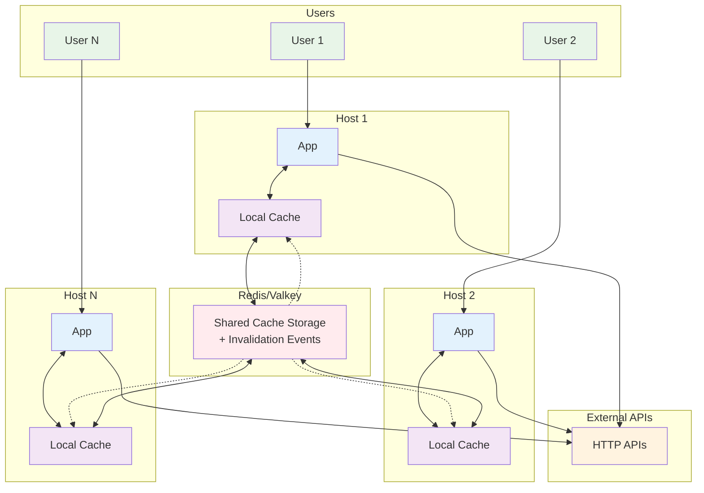

# @platformatic/undici-cache-redis

A high-performance Redis-backed cache store for [Undici's](https://github.com/nodejs/undici) cache interceptor. This library provides seamless HTTP response caching with Redis/Valkey as the storage backend, featuring client-side caching, cache invalidation by tags, and support for managed Redis environments.

Built on top of [iovalkey](https://github.com/valkey-io/iovalkey) for optimal Redis/Valkey connectivity.

## Features

- 🚀 **High Performance**: Redis-backed caching with client-side optimization
- 🏷️ **Cache Tags**: Invalidate cached responses by custom tags
- 🔄 **Automatic Invalidation**: Smart cache invalidation on mutating operations
- 📊 **Cache Management**: Built-in cache manager for monitoring and administration
- 🌐 **Vary Header Support**: Proper handling of content negotiation
- ☁️ **Cloud Ready**: Works with managed Redis services (AWS ElastiCache, etc.)
- 💾 **Binary Support**: Handles both text and binary response data
- 📈 **Tracking Cache**: Client-side caching for improved performance

## Installation

```bash
npm install @platformatic/undici-cache-redis
```

## Quick Start

### Basic Usage

```javascript
const { Client, interceptors } = require('undici')
const { RedisCacheStore } = require('@platformatic/undici-cache-redis')

// Create a Redis cache store
const store = new RedisCacheStore({
  clientOpts: {
    host: 'localhost',
    port: 6379,
    keyPrefix: 'my-app:cache:'
  }
})

// Create Undici client with caching
const client = new Client('https://api.example.com')
  .compose(interceptors.cache({ store }))

// Make requests - responses will be automatically cached
const response = await client.request({
  method: 'GET',
  path: '/users/123'
})

console.log(await response.body.text())
```

### Cache Invalidation by Tags

```javascript
const { Client, interceptors } = require('undici')
const { RedisCacheStore } = require('@platformatic/undici-cache-redis')

const store = new RedisCacheStore({
  cacheTagsHeader: 'cache-tags' // Header to read cache tags from
})

const client = new Client('https://api.example.com')
  .compose(interceptors.cache({ store }))

// Server responds with: Cache-Tags: user:123,profile
const response = await client.request({
  method: 'GET',
  path: '/users/123'
})

// Later, invalidate all cached responses tagged with 'user:123'
await store.deleteTags(['user:123'])
```

### Cache Management

```javascript
const { RedisCacheManager } = require('@platformatic/undici-cache-redis')

const manager = new RedisCacheManager({
  clientOpts: {
    host: 'localhost',
    port: 6379
  }
})

// Subscribe to cache events
await manager.subscribe()

manager.on('add-entry', (entry) => {
  console.log('Cache entry added:', entry.id)
})

manager.on('delete-entry', ({ id, keyPrefix }) => {
  console.log('Cache entry deleted:', id)
})

// Stream all cache entries
await manager.streamEntries((entry) => {
  console.log('Entry:', entry.origin, entry.path, entry.statusCode)
}, 'my-app:cache:')

// Get response body by ID
const responseBody = await manager.getResponseById('entry-id', 'my-app:cache:')
```

## Configuration Options

### RedisCacheStore Options

```typescript
interface RedisCacheStoreOpts {
  // Redis client options (passed to iovalkey)
  clientOpts?: {
    host?: string
    port?: number
    keyPrefix?: string
    // ... other iovalkey options
  }
  
  // Maximum size in bytes for a single cached response
  maxEntrySize?: number
  
  // Maximum total cache size (for client-side cache)
  maxSize?: number
  
  // Maximum number of entries (for client-side cache)
  maxCount?: number
  
  // Enable/disable client-side tracking cache (default: true)
  tracking?: boolean
  
  // Header name to read cache tags from responses
  cacheTagsHeader?: string
  
  // Error callback function
  errorCallback?: (err: Error) => void
}
```

### RedisCacheManager Options

```typescript
interface RedisCacheManagerOpts {
  // Redis client options
  clientOpts?: {
    host?: string
    port?: number
    // ... other iovalkey options
  }
  
  // Whether to configure keyspace event notifications (default: true)
  // Set to false for managed Redis services
  clientConfigKeyspaceEventNotify?: boolean
}
```

## Advanced Usage Examples

### Working with Vary Headers

```javascript
const store = new RedisCacheStore()
const client = new Client('https://api.example.com')
  .compose(interceptors.cache({ store }))

// Different responses cached based on Accept-Language header
const responseEn = await client.request({
  method: 'GET',
  path: '/content',
  headers: { 'Accept-Language': 'en' }
})

const responseFr = await client.request({
  method: 'GET',
  path: '/content',
  headers: { 'Accept-Language': 'fr' }
})
```

### Manual Cache Operations

```javascript
const store = new RedisCacheStore()

// Delete specific cache entries
await store.deleteKeys([
  { origin: 'https://api.example.com', method: 'GET', path: '/users/123' }
])

// Delete by cache tags
await store.deleteTags(['user:123', 'profile'])

// Close the store when done
await store.close()
```

### Error Handling

```javascript
const store = new RedisCacheStore({
  errorCallback: (err) => {
    console.error('Cache error:', err.message)
    // Send to monitoring service
    monitoringService.error('cache_error', err)
  }
})
```

## Managed Redis Services

When using managed Redis services like AWS ElastiCache, some Redis commands may be restricted. Configure the cache manager accordingly:

```javascript
const manager = new RedisCacheManager({
  clientConfigKeyspaceEventNotify: false, // Disable auto-configuration
  clientOpts: {
    host: 'your-elasticache-endpoint.cache.amazonaws.com',
    port: 6379
  }
})
```

Ensure your managed Redis instance has the following configuration:
- `notify-keyspace-events AKE` (if not automatically configured)

## Multi-Host Architecture



**Flow**: Users make requests → Apps check local/Redis cache → If miss, fetch from APIs → Cache responses → Invalidation events sync all hosts.

## Cache Key Structure

The library uses a structured approach to Redis keys:

- **Metadata keys**: `{prefix}metadata:{origin}:{path}:{method}:{id}`
- **Value keys**: `{prefix}values:{id}`
- **ID keys**: `{prefix}ids:{id}`
- **Tag keys**: `{prefix}cache-tags:{tag1}:{tag2}:{id}`

Where `{prefix}` is your configured `keyPrefix` and `{id}` is a UUID for each cache entry.

## Cache Invalidation Flow

The following diagram illustrates how cache invalidation works across different scenarios:


### Invalidation Methods

1. **Direct Key Deletion**: Targets specific cache entries by URL pattern
2. **Tag-based Deletion**: Removes all entries associated with given cache tags
3. **Automatic Expiration**: Handles Redis TTL expiration and manual deletions
4. **Client-side Tracking**: Maintains local cache consistency via Redis invalidation notifications

## Performance Considerations

1. **Client-side Tracking**: Enabled by default, provides in-memory caching of metadata
2. **Pipeline Operations**: Uses Redis pipelining for batch operations
3. **Binary Data**: Efficiently handles binary responses with base64 encoding
4. **Memory Management**: Configurable size limits prevent memory exhaustion

## API Reference

### RedisCacheStore

#### Methods

- `get(key: CacheKey): Promise<GetResult | undefined>` - Retrieve cached response
- `createWriteStream(key: CacheKey, value: CachedResponse): Writable` - Create write stream for caching
- `delete(key: CacheKey): Promise<void>` - Delete cache entries by key pattern
- `deleteKeys(keys: CacheKey[]): Promise<void>` - Delete multiple cache entries
- `deleteTags(tags: string[]): Promise<void>` - Delete entries by cache tags
- `close(): Promise<void>` - Close Redis connections

#### Events

- `write` - Emitted when a cache entry is written

### RedisCacheManager

#### Methods

- `streamEntries(callback, keyPrefix): Promise<void>` - Stream all cache entries
- `subscribe(): Promise<void>` - Subscribe to cache events
- `getResponseById(id, keyPrefix): Promise<string | null>` - Get response body by ID
- `getDependentEntries(id, keyPrefix): Promise<CacheEntry[]>` - Get entries sharing cache tags
- `deleteIds(ids, keyPrefix): Promise<void>` - Delete entries by IDs
- `close(): Promise<void>` - Close connections

#### Events

- `add-entry` - Emitted when a cache entry is added
- `delete-entry` - Emitted when a cache entry is deleted
- `error` - Emitted on errors

## Troubleshooting

### Common Issues

**Connection Errors**
```javascript
// Ensure Redis is running and accessible
const store = new RedisCacheStore({
  clientOpts: {
    host: 'localhost',
    port: 6379,
    connectTimeout: 10000,
    retryDelayOnFailover: 100
  }
})
```

**Memory Issues**
```javascript
// Limit cache size to prevent memory exhaustion
const store = new RedisCacheStore({
  maxEntrySize: 1024 * 1024, // 1MB per entry
  maxSize: 100 * 1024 * 1024, // 100MB total
  maxCount: 10000 // Max 10k entries
})
```

**Managed Redis Issues**
```javascript
// For AWS ElastiCache or similar services
const manager = new RedisCacheManager({
  clientConfigKeyspaceEventNotify: false,
  clientOpts: {
    host: 'your-cluster.cache.amazonaws.com',
    port: 6379,
    family: 4, // Force IPv4
    enableReadyCheck: false
  }
})
```

## Requirements

- Node.js >= 20
- Redis >= 6.0 or Valkey >= 7.2
- Undici >= 7.0

## License

Licensed under the Apache License, Version 2.0 (the "License");
you may not use this file except in compliance with the License.
You may obtain a copy of the License at

    http://www.apache.org/licenses/LICENSE-2.0

Unless required by applicable law or agreed to in writing, software
distributed under the License is distributed on an "AS IS" BASIS,
WITHOUT WARRANTIES OR CONDITIONS OF ANY KIND, either express or implied.
See the License for the specific language governing permissions and
limitations under the License.

## Benchmarking

This project includes comprehensive benchmarks to measure performance improvements with different caching strategies.

### Quick Benchmark
```bash
# Automated benchmark with all prerequisites checked
./run-benchmarks.sh

# Or run manually
npm run bench
```

The benchmarks test a realistic proxy server architecture:
- **Server FOO (Proxy)**: Uses Undici with different cache configurations  
- **Server Bar (Backend)**: API server with simulated latency
- **Autocannon**: Load testing tool measuring performance

Expected results show **10-15x performance improvement** with caching enabled.

For detailed benchmarking instructions, see [benchmarks/README.md](./benchmarks/README.md).
## Contributing

This project is part of the Platformatic ecosystem. For contributing guidelines, please refer to the main [Platformatic repository](https://github.com/platformatic/platformatic).

## Related Projects

- [Undici](https://github.com/nodejs/undici) - HTTP/1.1 client for Node.js
- [iovalkey](https://github.com/valkey-io/iovalkey) - High-performance Valkey client
- [Platformatic](https://github.com/platformatic/platformatic) - Enterprise-Ready Node.js
