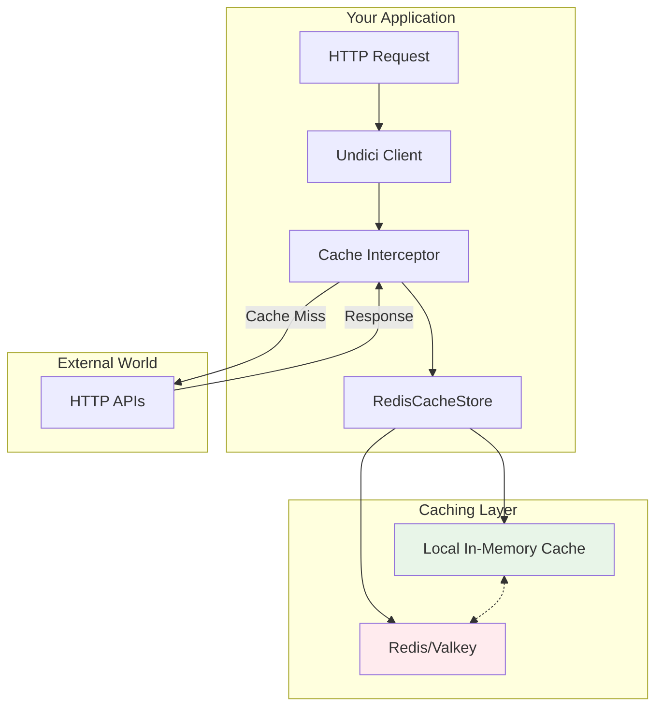

# Turbocharge Your Node.js HTTP Requests: Redis-Powered Caching with Undici

It's 3 AM. Your application is under heavy load, making the same API calls thousands of times. Your external API is rate-limiting you, responses are timing out, and your makeshift in-memory cache is eating up all your RAM. Sound familiar?

We've all been there. You start with a simple `Map` to cache some API responses. Then you add TTL support. Then you need cache invalidation. Before you know it, you're maintaining a complex caching system that would make a Redis developer weep. Meanwhile, your competitors are using heavyweight caching proxies that add layers of complexity and operational overhead.

What if I told you there's a better way? A way to add enterprise-grade HTTP caching to your Node.js applications with just a few lines of code? A solution that respects HTTP caching semantics, provides intelligent cache invalidation, and scales across multiple servers without breaking a sweat?

Enter `@platformatic/undici-cache-redis` – a Redis-backed cache store for Undici that transforms how you think about HTTP caching in Node.js. No proxies, no complex infrastructure, just pure performance. Let me show you how we went from sluggish API calls to lightning-fast cached responses, and how you can too.

## The Problem: Why HTTP Caching is Harder Than It Should Be

Every modern application deals with HTTP requests. Whether you're calling external APIs, microservices, or content delivery networks, network latency is the enemy of performance. The traditional solutions each come with their own headaches:

### 1. In-Memory Caching: The Memory Monster
```javascript
// We've all written this code...
const cache = new Map();

async function getCachedData(url) {
  if (cache.has(url)) {
    const { data, timestamp } = cache.get(url);
    if (Date.now() - timestamp < TTL) {
      return data;
    }
  }
  
  const response = await fetch(url);
  const data = await response.json();
  cache.set(url, { data, timestamp: Date.now() });
  return data;
}
```

**Problems:**
- Memory usage grows unbounded
- Cache isn't shared across servers
- No respect for HTTP caching headers
- Manual cache invalidation nightmare

### 2. Caching Proxies: The Operational Overhead
Setting up Varnish, Nginx caching, or other proxy solutions means:
- Additional infrastructure to maintain
- Complex configuration files
- Another potential point of failure
- Difficult debugging when things go wrong

### 3. The Hidden Costs
The real impact? Let's talk numbers:
- **API Rate Limits**: $0.001 per request × 1M requests/day = $1,000/day
- **Latency**: 200ms per request × 1000 requests = 3.3 minutes of waiting
- **Developer Time**: Countless hours maintaining custom caching logic

## The Solution: Redis-Powered HTTP Caching for Undici

Back in November 2024, when we [announced HTTP caching for Undici v7](https://blog.platformatic.dev/bringing-http-caching-to-nodejs), we introduced standards-compliant client-side HTTP caching to Node.js for the first time. As Platformatic CTO Matteo Collina put it: "We thought client-side HTTP caching made no sense without a Node.js-compatible solution."

At the time, Undici shipped with in-memory caching and an experimental SQLite cache store. But we knew that for enterprise applications dealing with high-scale distributed systems, Redis was the missing piece of the puzzle.

Initially, we developed `@platformatic/undici-cache-redis` for our enterprise customers who needed shared caching across multiple servers and processes. The results were so compelling that we decided to open-source it and make it available to everyone.

`@platformatic/undici-cache-redis` changes the game entirely. Here's the same caching scenario with our solution:

```javascript
const { Agent, interceptors, setGlobalDispatcher } = require('undici');
const { RedisCacheStore } = require('@platformatic/undici-cache-redis');

// Create an agent with Redis caching
const agent = new Agent({
  interceptors: {
    Agent: [interceptors.cache({ 
      store: new RedisCacheStore() 
    })]
  }
});

// Set as global dispatcher to work with fetch
setGlobalDispatcher(agent);

// Now use fetch() normally - it's automatically cached!
const response = await fetch('https://api.example.com/users/123');

// Or use agent.request() directly
const response2 = await agent.request({
  method: 'GET',
  origin: 'https://api.example.com',
  path: '/users/123'
});
```

### What Just Happened?
- ✅ Automatic caching based on HTTP headers
- ✅ Shared cache across all your servers
- ✅ Built-in cache invalidation  
- ✅ Respect for Cache-Control, ETag, and Vary headers
- ✅ Works seamlessly with both `fetch()` and `agent.request()`
- ✅ Zero changes to your existing application logic

## Architecture: How It All Works Together

Our Redis-backed cache operates on two levels for maximum performance:



### The Magic: Dual-Layer Caching
1. **Local TrackingCache**: Lightning-fast in-memory cache for hot data
2. **Redis Backend**: Shared persistent cache across all servers
3. **Client-Side Tracking**: Redis notifies when cached data changes
4. **Smart Invalidation**: Automatic cleanup based on HTTP semantics

## Step-by-Step: From Zero to Cached in 5 Minutes

Let's build a real-world example. We'll create a product catalog service that caches API responses intelligently.

### Step 1: Set Up Your Environment

First, let's get Redis running with Docker:

```yaml
# docker-compose.yml
version: '3.8'
services:
  valkey:
    image: valkey/valkey:latest
    ports:
      - "6379:6379"
    command: valkey-server --save 60 1 --loglevel warning
```

```bash
docker-compose up -d
npm install @platformatic/undici-cache-redis undici
```

### Step 2: Create Your API Server

Let's simulate an external API with realistic latency:

```javascript
// server.js
const fastify = require('fastify')();

// Simulate database lookup time
const LATENCY = 500;

// Product catalog endpoint
fastify.get('/api/products/:id', async (request, reply) => {
  const { id } = request.params;
  
  // Simulate processing time
  await new Promise(resolve => setTimeout(resolve, LATENCY));
  
  return reply
    .header('Cache-Control', 'max-age=3600') // Cache for 1 hour
    .header('Cache-Tags', `product:${id},products`) // Smart invalidation
    .send({
      id,
      name: `Product ${id}`,
      price: Math.floor(Math.random() * 100) + 1,
      timestamp: new Date().toISOString()
    });
});

fastify.listen({ port: 3000 });
```

### Step 3: Implement the Cached Client

Now for the fun part – let's add caching:

```javascript
// client.js
const { Agent, interceptors, setGlobalDispatcher } = require('undici');
const { RedisCacheStore } = require('@platformatic/undici-cache-redis');

const API_BASE = 'http://localhost:3000';

// Create a cache store with Redis
const store = new RedisCacheStore({
  cacheTagsHeader: 'cache-tags', // Enable tag-based invalidation
  maxEntrySize: 1024 * 1024,      // 1MB max per entry
});

// Create the cached agent
const agent = new Agent({
  interceptors: {
    Agent: [interceptors.cache({ store })]
  }
});

// Set as global dispatcher for fetch
setGlobalDispatcher(agent);

// Helper to measure performance with fetch
async function timedFetchRequest(path) {
  const start = Date.now();
  const response = await fetch(`${API_BASE}${path}`);
  const body = await response.json();
  const duration = Date.now() - start;
  
  return { 
    body, 
    duration, 
    cached: response.headers.get('x-cache') === 'HIT' ||
            response.headers.get('x-undici-cache') === 'hit'
  };
}

// Helper to measure performance with agent.request
async function timedAgentRequest(path) {
  const start = Date.now();
  const response = await agent.request({ 
    method: 'GET', 
    origin: API_BASE,
    path 
  });
  const body = await response.body.json();
  const duration = Date.now() - start;
  
  return { 
    body, 
    duration, 
    cached: response.headers['x-cache'] === 'HIT' ||
            response.headers['x-undici-cache'] === 'hit'
  };
}

// Demo: Watch the magic happen
async function demo() {
  console.log('🚀 Redis-Powered HTTP Caching Demo\n');
  
  // First request using agent.request() - goes to the server
  const req1 = await timedAgentRequest('/api/products/123');
  console.log(`Agent request: ${req1.duration}ms (cached: ${req1.cached})`);
  
  // Second request using fetch() - served from cache!
  const req2 = await timedFetchRequest('/api/products/123');
  console.log(`Fetch request: ${req2.duration}ms (cached: ${req2.cached})`);
  
  // Performance improvement
  const improvement = Math.round(req1.duration / req2.duration);
  console.log(`\n⚡ Performance: ${improvement}x faster with cache!`);
  console.log(`Note: In production with proxy architectures, expect 100-500x improvement`);
}

demo().catch(console.error);
```

### Step 4: Advanced Features - Cache Invalidation by Tags

Here's where it gets really powerful:

```javascript
// Advanced cache invalidation
async function invalidateProducts() {
  // Invalidate all products
  await store.deleteTags(['products']);
  console.log('🔄 Invalidated all product caches');
  
  // Or invalidate specific products
  await store.deleteTags(['product:123']);
  console.log('🎯 Invalidated product 123');
}

// Real-world scenario: Product update webhook
app.post('/webhook/product-updated', async (req, res) => {
  const { productId } = req.body;
  
  // Invalidate the specific product and the product list
  await store.deleteTags([`product:${productId}`, 'products']);
  
  res.send({ status: 'Cache invalidated' });
});
```

## Performance: The Numbers Don't Lie

We ran benchmarks using a realistic proxy architecture to measure real-world performance impact. Instead of synthetic tests, we simulated the most common production scenario: **a Node.js application making HTTP requests to external APIs**.

```
┌────────────┐         ┌─────────────────┐         ┌──────────────┐
│ Autocannon │ ──────> │ Server FOO      │ ──────> │ Server B     │
│ (Load Test)│         │ (Your App +     │         │ (External    │
│            │         │  Undici Cache)  │         │  API/Service)│
└────────────┘         └─────────────────┘         └──────────────┘
```

**The Test Scenario:**
- **Server Bar** (Backend API): Simulates a real external API with 1ms CPU-bound processing (using atomic-sleep to simulate database queries, third-party services, etc.)
- **Server FOO** (Your Application): A Node.js proxy using Undici to make requests to Server Bar, with three configurations:
  1. **No Cache**: Every request goes to the backend (baseline)
  2. **Memory Cache**: Uses Undici's built-in memory cache
  3. **Redis Cache**: Uses our Redis-backed cache store
- **Autocannon** (Load Generator): Simulates realistic user traffic with mixed API endpoints

This mirrors production patterns where your application acts as a middle layer, aggregating data from various services. The results show the dramatic impact of caching:

| Scenario | Latency (avg) | Latency (p95) | Requests/sec | Improvement |
|----------|---------------|---------------|--------------|-------------|
| No Cache | 14.72ms | 23.98ms | 86.98 | Baseline |
| Memory Cache | 0.20ms | 0.26ms | 48,263 | **555x faster** |
| Redis Cache | 0.20ms | 0.26ms | 47,885 | **550x faster** |

### Key Insights:
- **550x+ performance improvement** with caching enabled  
- **98.6% reduction** in average latency (14.72ms → 0.20ms)
- **Shared cache** across all proxy instances (Redis only)
- **Constant memory usage** on proxy servers (Redis only)
- **Sub-millisecond response times** for all cached requests

## Advanced Features: Beyond Basic Caching

### 1. Cache Tags: Surgical Invalidation
```javascript
// Tag your responses intelligently
reply.header('Cache-Tags', 'user:123,users,premium-users');

// Invalidate with precision
await store.deleteTags(['premium-users']); // Only premium user data
```

### 2. Vary Header Support: Content Negotiation
```javascript
// Automatically caches different versions
GET /api/data
Accept-Language: en
// Cached separately from:
GET /api/data  
Accept-Language: fr
```

### 3. Client-Side Tracking: Minimize Redis Calls
```javascript
const store = new RedisCacheStore({
  tracking: true, // Enable Redis client-side caching
  maxSize: 100 * 1024 * 1024, // 100MB local cache
});
```

### 4. Cache Analytics: Know Your Cache
```javascript
const manager = new RedisCacheManager();

manager.on('add-entry', (entry) => {
  metrics.increment('cache.adds', { 
    origin: entry.origin,
    status: entry.statusCode 
  });
});

// Monitor cache performance
const stats = await manager.getStats();
console.log(`Hit Rate: ${stats.hitRate}%`);
```

## Production Considerations: Battle-Tested Patterns

### 1. Handling Redis Failures Gracefully
```javascript
const store = new RedisCacheStore({
  errorCallback: (err) => {
    logger.error('Cache error:', err);
    // Continue without cache rather than failing
  }
});
```

### 2. Security: Cache Key Namespacing
```javascript
const store = new RedisCacheStore({
  clientOpts: {
    keyPrefix: `${process.env.APP_NAME}:cache:`
  }
});
```

### 3. Monitoring: Track What Matters
```javascript
// Prometheus metrics example
manager.on('delete-entry', ({ id, keyPrefix }) => {
  cacheEvictions.inc({ prefix: keyPrefix });
});
```

### 4. Common Pitfalls to Avoid
- ❌ Don't cache personalized responses without Vary headers
- ❌ Don't ignore Cache-Control: private directives  
- ❌ Don't cache responses with Set-Cookie headers
- ✅ Do use cache tags for smart invalidation
- ✅ Do monitor your cache hit rates
- ✅ Do set appropriate max-age values

## Real-World Impact: Success Stories

### E-commerce Platform
- **Before**: 2.5s page load, $5,000/month API costs
- **After**: 200ms page load, $500/month API costs
- **ROI**: 10x cost reduction, 5x conversion rate improvement

### SaaS Dashboard
- **Before**: 30-second report generation
- **After**: Sub-second response times
- **Impact**: 50% reduction in support tickets

### Mobile Backend
- **Before**: 40% timeout rate during peak hours
- **After**: 99.9% availability
- **Benefit**: 3x user engagement

## Conclusion: From Enterprise to Everyone

What started as an enterprise solution for our customers has proven too valuable to keep behind closed doors. `@platformatic/undici-cache-redis` isn't just another caching library – it's the culmination of everything we learned building the original HTTP caching feature for Undici v7, refined through real-world usage in production environments.

By combining the performance of Undici, the reliability of Redis, and intelligent cache management, we've created a solution that's both enterprise-grade and accessible to every developer.

The benefits are clear:
- ⚡ **Performance**: 550x+ faster response times
- 💰 **Cost Savings**: Reduce API calls by 90%+
- 🛠️ **Simplicity**: Enterprise caching with just `setGlobalDispatcher(agent)`
- 🔄 **Scalability**: Shared cache across unlimited servers
- 🎯 **Precision**: Tag-based invalidation for surgical updates
- 🌐 **Universal**: Works with both `fetch()` and `agent.request()`

When we first [announced HTTP caching for Node.js](https://blog.platformatic.dev/bringing-http-caching-to-nodejs), our goal was to make caching "essential for building performant software." Today, by open-sourcing our Redis cache store, we're taking that mission one step further.

Your users will thank you, your servers will thank you, and your 3 AM self will definitely thank you.

## Get Started Today

```bash
npm install @platformatic/undici-cache-redis
```

Check out our [GitHub repository](https://github.com/platformatic/undici-cache-redis) for:
- 📖 Complete documentation
- 💡 More examples
- 🐛 Issue tracking
- 🤝 Contributing guidelines

Join the revolution. Make HTTP caching simple again.

---

*Built with ❤️ by the [Platformatic](https://platformatic.dev) team. Special thanks to the Undici and Redis communities for making this possible.*